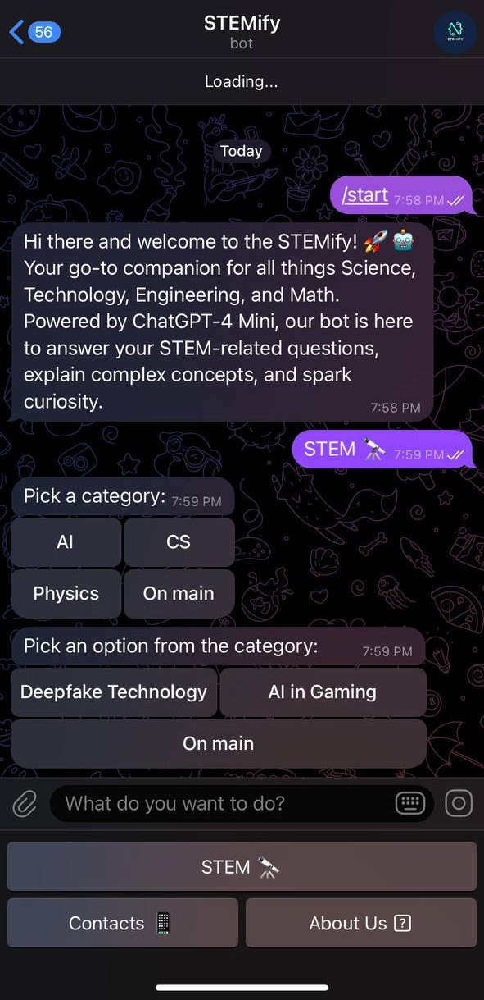
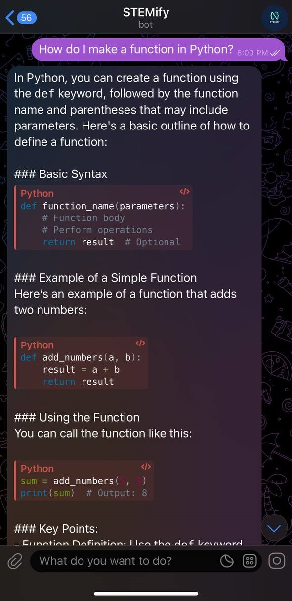

# STEMify Bot

STEMify is your go-to Telegram bot for exploring and learning about STEM (Science, Technology, Engineering, and Mathematics) topics. Whether you're curious about AI, Computer Science, or Physics, STEMify has got you covered. The bot also integrates ChatGPT-4.0 Mini, allowing you to ask questions directly and receive informative answers.

# At a Glance

<div style="display: flex; flex-direction: row; justify-content: space-between;">

  <div style="margin: 10px;">
      <p><strong>Starting a conversation with STEMify</strong></p>
    
  </div>

  <div style="margin: 10px;">
     <p><strong>Asking questions with ChatGPT in STEMify</strong></p>
    
  </div>

</div>

# Current Methods 
### 1. STEM Topic Selection
   
Start by sending the command `/start`. You'll be presented with a list of STEM topics to choose from, such as:
- AI (Artificial Intelligence)
- CS (Computer Science)
- Physics
  
Once a topic is selected, STEMify provides information on it. 

### 2. ChatGPT Integration

STEMify includes a built-in ChatGPT-4.0 Mini, allowing you to ask any question. Just type your question, and the bot will provide a detailed and accurate response.

# Get Started 
Get your own [ChatGPT](https://openai.com/api/) and [Telegram](https://core.telegram.org/bots/api) tokens. Add them to the config.py. 
1. Clone this repository and run:
    ```bash 
    pip install openai 
    pip install aiogram 
    pip install asyncio 
    pip install sqlalchemy

2. Run the bot:
   ``` bash
   python bot.py
    
